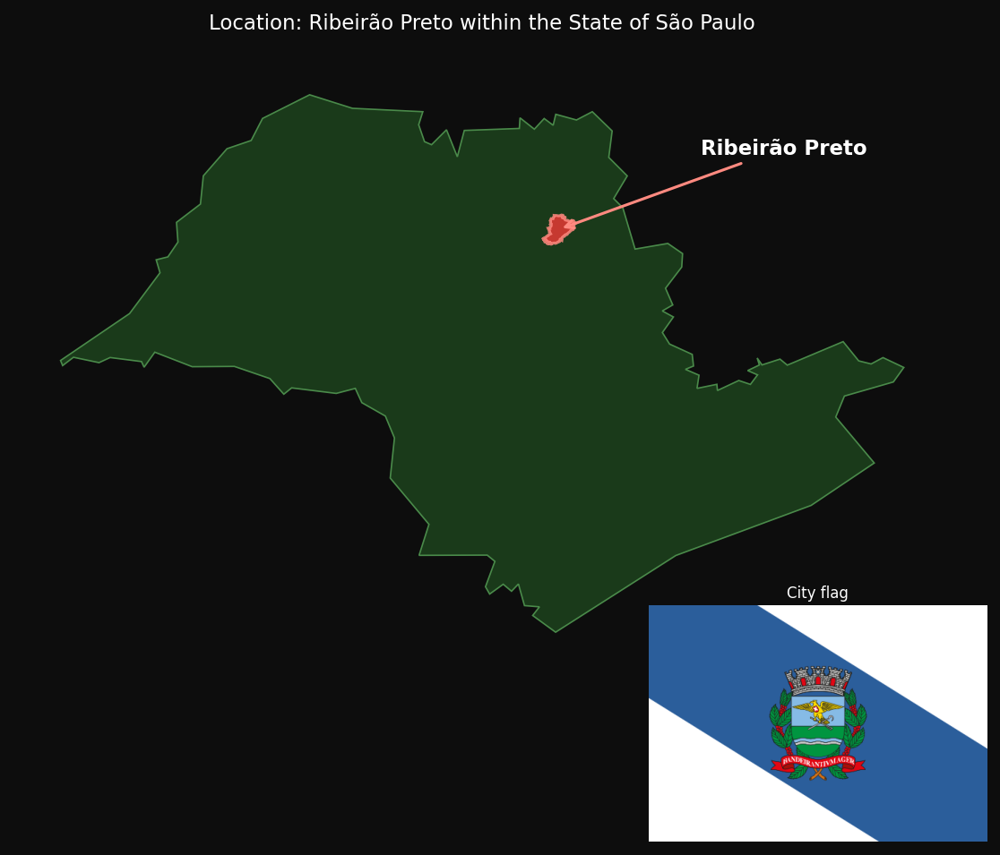
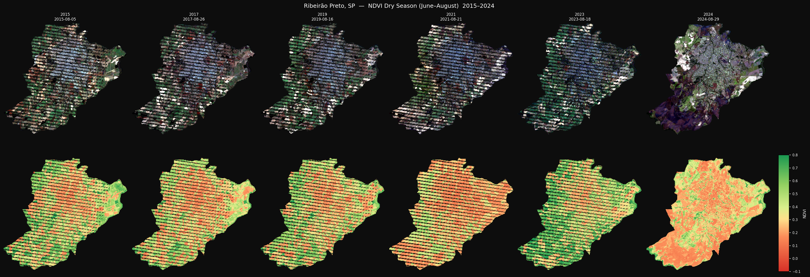
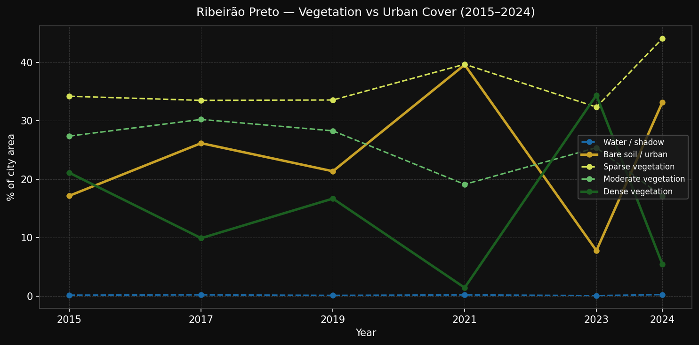

# Ribeirão Preto — Urban Expansion & Vegetation Loss (2015–2024)

> A 10-year satellite analysis of how one of Brazil's wealthiest cities
> has traded green cover for concrete.

---

## The City



**Ribeirão Preto** sits in the northeastern interior of São Paulo state,
approximately 313 km from the capital. Known as the *"Brazilian California"*
for its agricultural wealth, it is a major hub for agribusiness, healthcare,
and technology, with GDP per capita among the highest in the country's interior.

| Fact | Value | Source |
|---|---|---|
| Population estimate (2024) | 728,400 | IBGE |
| Population (Censo 2022) | 698,642 | IBGE |
| Population (Censo 2010) | 604,682 | IBGE |
| Territorial area | 650.916 km² | IBGE |
| Population density (2022) | 1,073 hab/km² | IBGE |
| GDP per capita (2023) | R$ 74,869 | IBGE |
| State | São Paulo | — |
| Coordinates | 21.17°S, 47.81°W | — |
| Economy | Sugarcane, soy, healthcare, tech | — |

Population grew **+15.5 %** between the 2010 and 2022 Censuses (+94,000 people),
reaching an estimated 728,400 by 2024. This sustained demographic pressure —
averaging roughly 7,800 new residents per year — is the primary driver of the
land-cover changes captured in the satellite record below.

The surrounding landscape is dominated by **sugarcane** and soy plantations —
making urban greenery within city limits particularly valuable, and particularly
under pressure.

---

## The Question

> How much vegetation has Ribeirão Preto lost over the last decade,
> and how much urban area has it gained?

To answer this, we used **Landsat 8/9 dry-season imagery** (June–August)
from 2015 to 2024. The dry season minimises cloud cover and reduces the
confounding effect of seasonal crop cycles on vegetation indices.

---

## Methodology

### Data source
- **Landsat Collection 2 Level-2** via [Microsoft Planetary Computer](https://planetarycomputer.microsoft.com/) — freely accessible, no authentication required.
- Resolution: ~120 m/pixel (resampled to EPSG:4326).
- Acquisition window: **August 1–31** per year — fixes the month across all years to reduce inter-year seasonality bias. August is the peak dry month for the São Paulo interior (lowest rainfall, most cloud-free scenes).
- Cloud cover threshold: ≤ 40 % (Landsat revisits every 16 days; ~2 scenes per month per path).
- City boundary: **OpenStreetMap Nominatim** (© OpenStreetMap contributors, ODbL).

### Index
```
NDVI = (NIR − Red) / (NIR + Red)
```

| NDVI range | Class |
|---|---|
| < 0.0 | Water / shadow |
| 0.00 – 0.20 | Bare soil / urban |
| 0.20 – 0.40 | Sparse vegetation |
| 0.40 – 0.60 | Moderate vegetation |
| 0.60 – 1.00 | Dense vegetation |

Pixels are clipped to the **official city boundary polygon** — no square bounding box.

---

## Results

### 10-Year NDVI Progression



*Top row: true-colour Landsat composite. Bottom row: NDVI map (red = low, green = high).
Years: 2015, 2017, 2019, 2021, 2023, 2024.*

### Vegetation vs Urban Cover Over Time



---

## Key Findings

### Raw statistics

| Year | Date | Bare/Urban | Sparse veg | Moderate veg | Dense veg | Median NDVI |
|---|---|---|---|---|---|---|
| 2015 | 2015-08-05 | 17.2 % | 34.2 % | 27.4 % | 21.1 % | +0.388 |
| 2017 | 2017-08-26 | 26.2 % | 33.5 % | 30.2 % |  9.9 % | +0.330 |
| 2019 | 2019-08-16 | 21.4 % | 33.5 % | 28.3 % | 16.7 % | +0.362 |
| 2021 | 2021-08-21 | 39.6 % | 39.7 % | 19.1 % |  1.4 % | +0.231 |
| 2023 | 2023-08-18 |  7.8 % | 32.3 % | 25.4 % | 34.4 % | +0.475 |
| 2024 | 2024-08-29 | 33.1 % | 44.0 % | 17.1 % |  5.5 % | +0.240 |

### Change 2015 → 2024

| Class | Change |
|---|---|
| Bare soil / urban | **+16.0 percentage points** |
| Sparse vegetation | +9.9 pp |
| Moderate vegetation | −10.3 pp |
| Dense vegetation | **−15.6 percentage points** |
| Median NDVI | **−0.148** |

### Interpretation

**Urban expansion is the dominant signal.**
Between 2015 and 2024, bare soil and urban surfaces increased by **+16 pp**,
while dense vegetation collapsed by **−15.6 pp** — a near-perfect trade-off
that reflects ongoing peripheral urbanisation along the city's northern,
southern, and western fringes.

**The median NDVI fell from +0.388 to +0.240** (−0.148), a decline of 38 %
relative to the 2015 baseline. An NDVI above 0.4 generally indicates active,
healthy vegetation; the city median dropped below that threshold by 2024.

**Year-to-year variability is real but the trend is clear.**
All acquisitions are fixed to August to minimise phenological drift, but
residual variability remains: sugarcane ratoon cycles, inter-annual rainfall
anomalies, and the exact acquisition day within August (up to ±15 days)
can shift pixel fractions by a few percentage points. Despite this noise,
the directional trend from 2015 to 2024 is unambiguous: **the city is
getting hotter, brighter, and less green**.

**Dense vegetation loss is the most concerning indicator.**
21.1 % of the city area classified as dense vegetation in 2015. By 2024 that
figure had fallen to 5.5 % — a **−74 % reduction** in the city's highest-NDVI
areas. These are the urban parks, riparian galleries (Mogi-Guaçu tributaries),
and remnant *cerrado* patches that provide the most ecosystem services: cooling,
air filtration, and stormwater retention.

---

## Broader Context

Ribeirão Preto's urban sprawl follows a pattern common to prosperous Brazilian
interior cities: low-density horizontal expansion driven by automobile-centric
planning and speculative land markets. The city's *plano diretor* (master plan)
has been repeatedly criticised by urban researchers for prioritising road
infrastructure over green belts.

The loss of green cover has measurable public-health consequences: urban heat
island effect intensifies, flooding risk increases as permeable surfaces disappear,
and the cost of cooling buildings rises — ironically increasing carbon emissions
in a city that prides itself on sugarcane-ethanol sustainability.

---

## Reproduce This Analysis

### Requirements

```bash
pip3 install -r requirements.txt Pillow
```

### Run

```bash
python3 ribeirao_preto_analysis.py
```

The script fetches all data automatically from Microsoft Planetary Computer
(no account required) and caches downloaded arrays in `outputs/cache/` so
subsequent runs skip the download step.

```
outputs/
├── cache/             Cached NDVI + RGB arrays per year
├── ndvi_timeseries.png
├── trend_chart.png
├── location_map.png
└── summary.txt
```

---

## Data Sources

| Source | Description | Licence |
|---|---|---|
| [Landsat Collection 2 L2](https://www.usgs.gov/landsat-missions/landsat-collection-2-level-2-science-products) | Surface reflectance, Landsat 8/9 | Public domain (USGS/NASA) |
| [Microsoft Planetary Computer](https://planetarycomputer.microsoft.com/) | STAC API and COG hosting | CC-BY |
| [OpenStreetMap / Nominatim](https://nominatim.openstreetmap.org/) | City boundary polygon | © OpenStreetMap contributors, ODbL |
| [IBGE — Serviço de Dados](https://servicodados.ibge.gov.br/) | Population (Censos 2010/2022), estimates 2015/2024, area, GDP per capita | Public domain (Brazilian government) |
| [Wikimedia Commons](https://commons.wikimedia.org/wiki/File:Bandeira_de_Ribeir%C3%A3o_Preto.svg) | City flag | Public domain |

---

## Citation

If you use this analysis, please cite the data sources above and link to this repository.

---

*Analysis performed with [`ndvi_explorer.py`](ndvi_explorer.py) and
[`ribeirao_preto_analysis.py`](ribeirao_preto_analysis.py).
Tool documentation: [`NDVI_EXPLORER.md`](NDVI_EXPLORER.md).
Satellite data © USGS / NASA. City boundary © OpenStreetMap contributors.*
